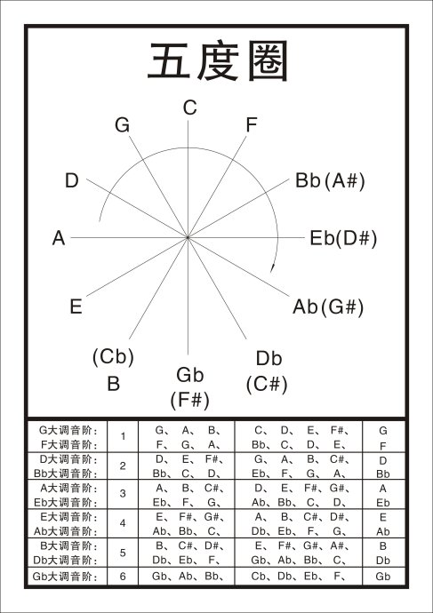

### 学前乐理部分

#### 挑战音高
十二音高很好唱，7个自然5个降，BEADGCF，前面5个音再降

#### 挑战音名
7升7降7自然，5个重升5重降

#### 挑战唱名
简谱唱名不用烦，5升5降7自然
4152637，上行下行都一样，左边5个变音升，右边五个变音降
唱名一共有十七，4152637，变音b7b3b6b2b5（Te，Me，Le，Ra，Se），还有#4#1#5#2#6（Fi，Di，Si，Ri，Li）
半音上行，顺6，半音下行，逆6

#### 挑战调名
一圈只有十二调，谱上却是十五调，因为圈底另外有，三个同音异名调
十五调名十二调，同音异名三个调，七个自然两个升，再加六个降号调

#### 挑战调音
顺一反数7音名，就是同调7个音，顺一反7四字诀，就知所有各调音
挑战调号
七个升调七降调，C调没有升降号
升调不用降记号，降调不用升记号，顺一反数七个音，各调调号就知道

## 基础乐理部分

#### 音阶
挑战五声大调
123三音反跳，56两音中间跳
挑战七声大调
反行先跳123，回头由4跳到7
挑战七声小调
大调降3是真小，36都降是和小，如果不会降半音，那就来个横顺跳

#### 调式
1 Ionian（maj） 2 Dorian 3 Phrygian 4 Lydian（maj） 5 Mixolydian（maj） 6 Aeolian 7 Locrian
12个音84个调式
挑战七声调式
12356反跳，37两音要横跳，只要运用八字诀（37顺六，其他反三），所有调式跑不掉

#### 音程
挑战音程
纯四纯五2顺反，大二小七3顺反，大六小三4顺反，大三小六5顺反，大七小二6顺反，增四减五7顺反
增四减五对角线，纯四纯五横顶线，大二小七横二线，大六小三横中线，大三小六横四线，大七小二横底线

#### 和弦
挑战和弦
顺行4步小三度，反行5步大三度，运用顺反打油诗，推算和弦无难处
挑战三和弦
（C）先反后顺是大三，（Cm）先顺后反是小三，（C。）减三和弦两个顺，（C+）增三和弦两个反
48个三和弦
挑战常用和弦
（C7）属七和弦反顺顺，（CM7
）大七和弦反顺反，（Cm7）小七和弦顺反顺，（Cm7b5）半减和弦顺顺反
挑战少用和弦
（C+M7）增大和弦反反顺，（CmM7）小大和弦顺反反
挑战无调和弦
（C。7）减七和弦三个顺（十字），（C+8）增三和弦三个反

复习
挑战音阶与和弦
每调都有七调式，各调共有八十四，七和弦有七类型，各调也有八十四
37顺六余反三，可推调式八十四，反五顺四大小三，可算和弦八十四

吉他指板
主音顺行四个音，反跳五步回主音
